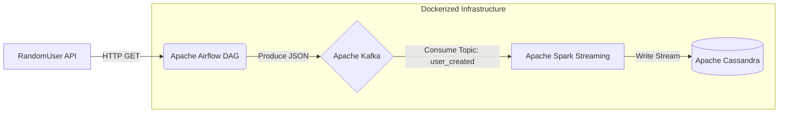

# Data Engineering Kafka Streaming Pipeline

## Project Overview

This project is an end-to-end Data Engineering pipeline that demonstrates real-time data streaming and processing. It fetches user data from a public API, streams the data through a message broker, processes it using a distributed computing framework, and ultimately stores it in a NoSQL database for analytical querying.

The entire infrastructure is containerized and orchestrated using Docker Compose.

## Architecture

The data pipeline follows this general workflow:
1. **Data Ingestion:** Apache Airflow periodically triggers a Python script that fetches random user data from `https://randomuser.me/api/`.
2. **Message Broker:** The formatted data is sent as JSON messages to an Apache Kafka topic named `user_created`.
3. **Stream Processing:** A PySpark Streaming application consumes the data from the Kafka topic, applies necessary schema transformations, and prepares it for insertion.
4. **Storage:** The processed streaming data is written in real-time into an Apache Cassandra database.



## Technologies Used

*   **Apache Airflow:** Workflow orchestration and data extraction.
*   **Apache Kafka & Zookeeper:** Distributed event streaming platform (Confluent Platform).
*   **Apache Spark (PySpark):** Real-time data processing and transformation.
*   **Apache Cassandra:** Highly scalable NoSQL database for destination storage.
*   **PostgreSQL:** Backend database for Airflow metadata.
*   **Docker & Docker Compose:** Containerization and service orchestration.
*   **Python:** Programming language for DAGs and Spark jobs.

## Prerequisites

Before you begin, ensure you have the following installed on your machine:
*   [Docker](https://docs.docker.com/get-docker/)
*   [Docker Compose](https://docs.docker.com/compose/install/)
*   [Python 3.8+](https://www.python.org/downloads/)

## Getting Started

### 1. Clone the repository

```bash
git clone https://github.com/KhanhXoe/kafka_random_guy_confluentinc.git
cd data_engineering_kafka_streaming
```

### 2. Environment Variables

Ensure you have an `.env` file in the root directory. This file should contain all the necessary environment variables required by the `docker-compose.yml` (e.g., database credentials, Airflow settings).

*(If you don't have one, please create it based on the variables referenced in the `docker-compose.yml`)*

### 3. Start the Infrastructure

Run the following command to spin up all the required services in the background:

```bash
docker-compose up -d
```

This will start:
- Zookeeper & Kafka Broker
- Schema Registry & Control Center (Access via `localhost:9021`)
- PostgreSQL
- Airflow Webserver (Access via `localhost:8080`) & Scheduler
- Spark Master & Workers
- Cassandra Database

### 4. Initialize Cassandra (Automated)

The `cassandra-init` service will automatically create the required keyspace (`spark_streaming`) and table based on the `cassandra_init.cql` file once Cassandra is healthy.

### 5. Run the Spark Streaming Job

To start consuming data from Kafka and writing to Cassandra, you need to submit the Spark job. You can do this by executing the script locally (if you have Spark configured) or by submitting it to the Spark Master container:

```bash
# Example command if running within the master container
docker exec -it spark-masters spark-submit \
  --packages com.datastax.spark:spark-cassandra-connector_2.12:3.4.1,org.apache.spark:spark-sql-kafka-0-10_2.12:3.5.0 \
  /path/to/spark_streaming.py
```
*(Note: Ensure the python script is mounted or copied into the Spark container to run)*

### 6. Trigger Airflow DAG

1. Open your browser and navigate to `http://localhost:8080`.
2. Login using the credentials specified in your `.env` file (for `AIRFLOW_USER` and `AIRFLOW_PASSWORD`).
3. Unpause and trigger the `kafka_stream` DAG.
4. The DAG will start fetching data and sending it to the Kafka broker.

### 7. Verify Data in Cassandra

You can connect to the Cassandra container using `cqlsh` to verify that data is being populated:

```bash
docker exec -it cassandra cqlsh -u <CASSANDRA_USERNAME> -p <CASSANDRA_PASSWORD>
```
Inside the cqlsh prompt:
```sql
USE spark_streaming;
SELECT * FROM user_created;
```

## Shutting Down

To stop and remove all running containers, networks, and volumes:

```bash
docker-compose down -v
```

## License

This project is licensed under the Apache License 2.0 - see the [LICENSE](LICENSE) file for details.
